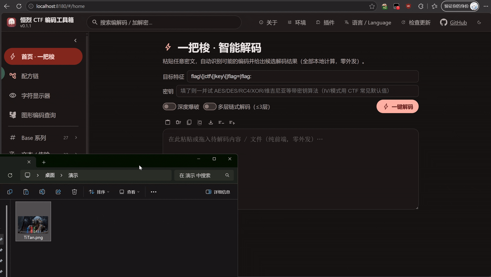
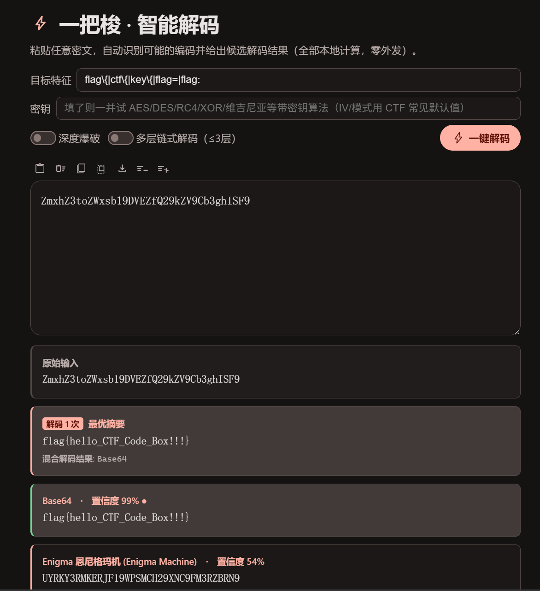
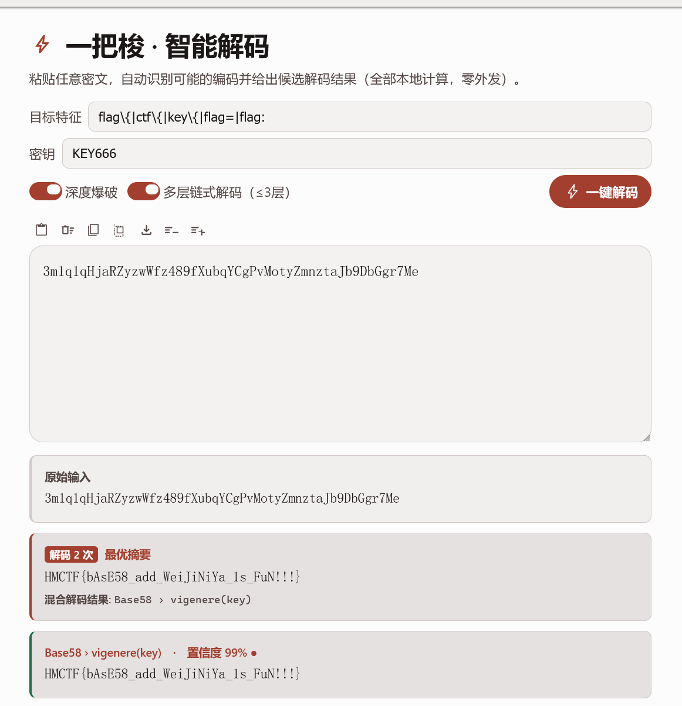
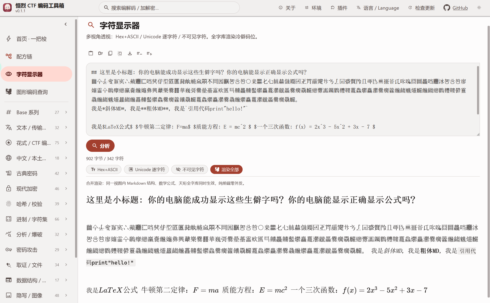
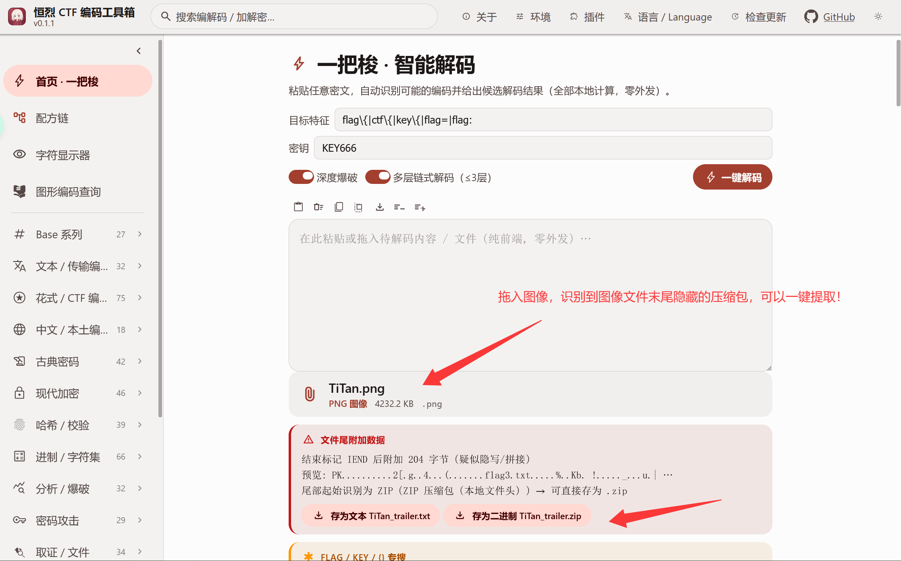
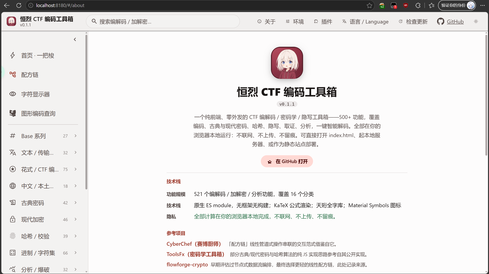

<p align="center">
  
</p>

<h1 align="center">恒烈 CTF 编码工具箱 · EBCTFCodeBox</h1>

<p align="center">
  纯前端、零外发的 CTF 编解码 / 加解密 / 隐写分析工具箱<br/>
  <b>500+ 编解码算法全在浏览器本地运行,不向任何服务器发送一个字节</b>
</p>

---

> [!NOTE]
> 这是一篇面向使用者的功能介绍。想直接上手,拉下来打开一个网页就能用;想深入,往下读,每一节都是一个能救急的场景。

## 一、它是什么:一个页面,应付赛场绝大多数编解码

打开一个网页,CTF 里常见的编码、古典密码、现代加密、哈希校验、进制转换、密码分析爆破、隐写图像,全都在这里。**所有计算在浏览器本地完成,不联网、不上传。**

- **500+ 独立算法**,覆盖十大分类:Base 系列 / 文本传输编码 / 花式 CTF 编码 / 中文本土编码 / 古典密码 / 现代加密 / 哈希校验 / 进制字符集 / 分析爆破 / 隐写图像。
- 每个算法都是**独立、纯函数式**的一条注册记录,互不干扰,可单独调用、可串联、可被插件扩展。
- 冷门到「社会主义核心价值观」「佛曰」「熊曰」「兽音译者」,常用到 AES / RSA / SM4 国密 / 维吉尼亚 / 栅栏,一个界面全覆盖。

而最省事的入口,是**一把梭**。




## 二、一把梭 · 智能解码:粘进去,它自己认

拿到一串不知道是什么编码的密文,不用一个个试。粘进去,点「一键解码」,它会自动识别可能的编码链并给出候选结果,按可信度排序。

它背后其实是两套引擎并存:

- **穷举全解** —— 对所有可解码算法跑一遍,靠字符集指纹和输入特征预筛,带参算法自动做参数网格扫描,结果按分类平铺。
- **智能优选** —— 多层 BFS 搜索 + 综合评分,惩罚过长的解码链、奖励命中 `flag{...}` 或你指定的目标特征,只把最可能的几个结果顶到前面。

还支持:

- **目标特征(crib)过滤**:填 `flag{` / `ctf{` 之类,命中的候选直接高亮置顶。
- **密钥 + 密文一键尝试**:给定密钥,自动枚举 AES / DES / 3DES / RC4 / XOR / Fernet × 多种模式 × 多种编码组合。
- **深度爆破** 与 **多层链式解码(≤3 层)** 开关。

### 一键解码例子(单层)

```
输入:  SGVsbG8gQ1RG
        ↓ 自动识别为 Base64,解码
输出:  Hello CTF
```



### 多层解码例子(两层)

一把梭能把「先做 A 再做 B」的嵌套编码自动拆开。以两层为例:

```
密文:  dXJ5eWI=
        ↓ 第 1 层:识别 Base64 → 解码
        uryyb
        ↓ 第 2 层:识别 ROT13 特征 → 解码
明文:  hello
```

开启「多层链式解码」后,你不需要知道它套了几层、套了什么,粘进去等结果即可(最多自动展开 3 层)。



## 三、配方链:把多个算法串成一条流水线

一次性操作满足不了的场景,用**配方链**。它是一个可视化的链式编辑器:

- 左侧算法拖进链里,按需要排序,每个节点可单独指定编码 / 解码 / 运行模式。
- 底层是图模型 + 拓扑排序执行,支持多路输入拼接、环检测与校验。
- 配方可**导出 / 导入 JSON**(自有格式,连输入内容一起存,方便完整复现和分享给队友)。

内置几个开箱示例,照着改就能上手:

- `Hex → Base64`
- `Caesar(13) → ROT13`
- `URL decode → Base64 decode → MD5`


## 四、图形编码查询:253 张对照图鉴,人肉解码神器

遇到旗语、外星文字、游戏自造字、古代文字这种「只能看图对照」的编码,靠记忆是不现实的。内置**编码图鉴**,共 **253 张**图形编码对照表,分七大类:

| 分类 | 数量 | 例子 |
|---|---:|---|
| 符号编码 symbol | 68 | ADFGX、培根图形等 |
| 其他 other | 75 | 各类杂项对照表 |
| 外星文字 alien | 41 | Aurebesh、Standard Galactic 等 |
| 游戏文字 game | 33 | 各游戏自造字体 |
| 古代文字 ancient | 19 | 巴比伦、亚特兰蒂斯等 |
| 旗语手语 flag | 11 | 海事旗语、手语字母 |
| 条码 barcode | 6 | 各类一维 / 二维码示意 |

图片走本地资源、懒加载,左侧分类树 + 名称 / 别名搜索,右侧大图可缩放拖拽。看到一串看不懂的符号,先来这里翻。


## 五、天珩全字库:全 Unicode 显示,生僻字照样看得见

CTF 里常出现系统字体渲染不出来的生僻汉字、古文字、小语种符号 —— 别的工具显示成一堆「☐☐☐」豆腐块,这里不会。

工具箱内置 **天珩全字库(全字堂)V5.0.0**,覆盖全 Unicode、15 万余汉字及 Unicode 17.0 定义的各类符号与小语种,按 Unicode 平面**懒加载**(用到哪个平面才加载哪块字库)。配合独立的**字符显示器**,可对同一段输入做三视角透视:

- Hex + ASCII 双栏
- 逐字符 Unicode 表:码位 / 字形 / 名称 / 所属 block / 平面 / 类别
- 不可见 / 零宽字符的标记与清洗

> 

> 可复制的生僻字演示：`\## 这里是小标题：你的电脑能成功显示这些生僻字吗？你的电脑能显示正确显示公式吗？ 𧆘㐃𠄔𠆭𭥟𡧑𠁼𦹗𰻝𠥓𪠽𭁇𠇇𭍻𠥪𠥬𦮙𦘾𦝘𡦹𨷾𣎴𠕲㘢𩙤㔔㪳㫈〇𭪀𣡽𠤎𢖩𣏟𣡕𠍋𠪳𡆢𢀓𠄷𤕈𫬯𪜀𭚥𠄏𠕄𢨋𧹂𬻴𠀃𬻇𮍌𬻜𬻟𠁬𬼗𠮺𠲲𡆵𡈨龘𪠽𰻝𣲙㔔㪳㫈廖孃霝㐃鸊癴纞臝嚢虪䶯彝興𧅵樂爨䨻華巍彁爨曐蘲靁㰷匶巪齉龘齉齾爩麤龗灪龖厵爨癵驫麣纞虋讟钃鸜麷鞻龗鱻爩麤灪爨癵籱虪齺魕爧麣虪齺纞鸜麷鞻鬰靊飝虪齺魕爧蠿齺虪靐齉齾爩鱻爨癵籱饢驫麣龗鱻爩麤灪爨飝虪爩麤龗灪龖厵爨癵驫麣。 我是*斜体MD*，我是**粗体MD**，我是`引用代码print"hello!"` 我是$LaTeX公式$ $牛顿第二定律：F=ma$ $质能方程：E = mc^2 $ $一个三次函数：f(x) = 2x^3 - 5x^2 +  3x - 7 $`

## 六、文件识别 + 附加数据剥离:拖进去就分析

拖入一个文件,工具箱自动识别类型(靠魔数表 + 结构解析),并能做 CTF 里最常见的一件事 —— **剥离附加数据**。

**附加数据剥离(trailerCarve)** 两种模式:

- **trailer(精确)**:识别主体格式 → 按官方规范精确定位「正体结束偏移」→ 把其后藏的附加字节完整剥出来。支持精确定位的载体包括 PNG(遍历 chunk 到 IEND)、JPEG(FFD9)、GIF(0x3B)、ZIP(EOCD)、BMP、RIFF(WAV/AVI/WebP)、PDF(最后 %%EOF)等。
- **binwalk(全扫)**:对整个字节流滑窗匹配魔数表(RAR / 7Z / GZIP / XZ / ELF / PE / OGG / FLAC / PCAP 等约 25 种),列出所有命中偏移。

剥出的附加数据可直接查看长度、做魔数识别、hex / ASCII / Base64 呈现 —— 「图片后面藏了个压缩包」这类题,一步到位。




## 七、密码学学习:每个算法都带一张科普卡

这不只是查询工具,也是**学习工具**。面向大一大二学生,每个算法的操作页在输出框下方都渲染一张 **edu 科普卡**,讲清楚:

- **是什么(what)**:一句话定义
- **原理(principle)**:讲清机制,支持 KaTeX 数学公式
- **怎么用(usage)** 与可跑通的**输入输出例子(examples)**
- **公式(formulas)** 与 **CTF 实战贴士(tips)**
- **别名(aka)**:同时喂给搜索索引,换个叫法也搜得到


科普卡目标覆盖整个算法注册表,并提供中英双语层(英文缺失时回落中文)。**边用边学**:解一道题的同时,顺手就把这个编码 / 密码的原理弄明白了。

## 八、界面:谷歌 Material 3、昼夜模式、动态取色

- **昼夜三态**:`跟随系统 / 亮色 / 暗色`,默认跟随系统,系统明暗切换时实时联动。
- **Material 3 动态取色**:从单一「种子色」运行时生成 M3 tonal 调色板,一键换肤 / 改强调色。
- **系统强调色同步(Windows)**:通过本地桥读取系统强调色并应用到界面(纯本地计算,零外发)。
- **谷歌开源图标**:全套 Material Symbols(Apache 2.0),SVG 内联注入,零请求、零 CDN。

温和红主题,暗亮色随手切,看着舒服。




## 九、技术栈与超强兼容

追求「打开就能用、到处都能跑」:

- **原生 ES module,无框架、无构建步骤**:没有 React / Vue,UI 全是自持的 DOM 工具函数;改完刷新即生效,不需要 `npm build`。
- **WASM 承担高性能算法**:7-Zip(7z 解压)、bkcrack(ZipCrypto 已知明文攻击)均为本地编译产物,从本地懒加载、缺失时优雅降级,**零 CDN**。
- **纯静态部署**:任意静态服务器均可托管(`python`、`npx serve`、nginx / Apache / Caddy 皆可)。
- **PWA 离线可用**:支持的浏览器可「安装到桌面」,离线继续用。
- **本地桥(Windows)**:可选调起本机白名单外部工具(steghide / foremost / bkcrack / 各 GUI 隐写工具等);桥只监听 `127.0.0.1`,绝不外发;不可用时纯前端功能不受影响。
- **20 种语言 i18n**:含 5 种 RTL 语言(阿拉伯语 / 希伯来语 / 波斯语 / 乌尔都语 / 维吾尔语)自动切换右到左布局。

平台上,Windows(主平台,含本地桥全功能)/ macOS / Linux / ChromeOS / 移动端(PWA)全都能跑,前端 500+ 算法在哪都在线。

## 十、和同类产品比,我们的位置

> 说明:下表维度基于我们对同类产品的功能调研整理,竞品能力以公开信息为准,你可对照实际情况调整。
> 图例:✅ 支持　⚠️ 部分支持 / 有局限　❌ 不支持　🚧 规划中

| 能力维度 | 恒烈 CTF 工具箱 | 同类产品① | 同类产品② | 同类产品③ | 同类产品④ |
|---|:---:|:---:|:---:|:---:|:---:|
| 纯前端 · 零外发 · 本地运行 | ✅ | ✅ | ⚠️(桌面程序) | ⚠️ | ⚠️ |
| 编解码算法数量 | ✅ 500+ | ✅ 300+ | ✅ 多 | ⚠️ 一般 | ⚠️ 一般 |
| 一把梭智能自动解码 | ✅ | ⚠️(自动检测) | ✅ | ❌ | ⚠️ |
| 多层链式自动解码 | ✅ ≤3 层 | ⚠️ | ⚠️ | ❌ | ❌ |
| 可视化配方 / 流水线 | ✅ | ✅ | ⚠️ | ❌ | ❌ |
| 中文 / 本土编码(社核 / 佛曰 / 熊曰等) | ✅ | ❌ | ✅ | ⚠️ | ⚠️ |
| 图形编码图鉴(253 张对照) | ✅ | ❌ | ⚠️ | ❌ | ❌ |
| 内置密码学教学(edu 科普卡) | ✅ | ❌ | ❌ | ❌ | ❌ |
| 全 Unicode 字库显示(生僻字不豆腐) | ✅ | ⚠️(依赖系统字体) | ⚠️ | ⚠️ | ⚠️ |
| 文件识别 + 附加数据剥离 | ✅ | ⚠️ | ✅ | ⚠️ | ⚠️ |
| 隐写 / 图像分析 | ✅ | ⚠️ | ✅ | ⚠️ | ⚠️ |
| 外部工具桥接(steghide / bkcrack 等) | ✅(Windows) | ❌ | ✅ | ⚠️ | ❌ |
| 离线 PWA / 可安装 | ✅ | ⚠️ | ✅(本地程序) | ❌ | ❌ |
| 多语言界面 | ✅ 20 种 | ⚠️ | ⚠️(中文) | ⚠️ | ⚠️ |
| 插件 SDK / AI(MCP)扩展 | ✅ | ❌ | ❌ | ❌ | ❌ |
| 开源协议 | ✅ Apache 2.0 | ✅ | ❌ | ⚠️ | ⚠️ |

一句话总结:**别人强的它基本都有(配方、自动检测、隐写、外部工具),别人没有的它也有(内置教学、图形图鉴 253 张、全 Unicode 字库、插件 + MCP 扩展、20 语言),而且全程纯前端零外发。**

## 十一、开源地址与协议

- **仓库**:<https://github.com/Henglie/EBCTFCodeBox>
- **协议**:采用 **Apache License 2.0**,可自由使用、修改与再分发,详见仓库根目录 `LICENSE` 全文。
- 第三方组件(Material Symbols 图标、各 WASM 库、天珩字库等)各自遵循其原始许可证;天珩全字库为非商业授权,本项目仅作开源、非商业的本地显示用途。

## 十二、一起共创

这个工具箱还在长大,欢迎你加入:

- 🐛 **提 Issue**:发现 Bug、算法结果异常或文档缺失,欢迎反馈,最好附上输入样例、期望输出和复现步骤。
- 🔧 **写插件**:一个插件 = 一个标准 ESM 模块,零主项目改动就能注册新算法、新分类、新语言文案,还能通过 MCP / Skills 暴露给 AI 使用。
- 🌍 **补语言**:多一种母语,多一批用得上的人。
- 💡 **提想法**:想要什么编码、什么功能,尽管说。

> **贡献者会被写进「关于」页面。** 你的名字会一直在那里,和这个工具箱一起被每一个打开它的人看到。

<p align="center"><b>打开一个网页,就能应付赛场上绝大多数编解码需求。</b></p>
